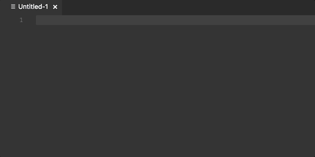

# gotimeformat

*gotimeformat* is a plugin for Visual Studio Code to generate go time layout from
a simple easy to remember format.

## Demo



## Layout
|timeformat|default|
----|----
YYYY|2006
YY|06
MMMM|January
MMM|Jan
MM|01
M|1
DD|02
D|2
hh|03
HH|15
h|3
wwww|Monday
www|Mon
mm|04
m|4
ss|05
s|5
f|0 *(.fff = .000)*
F|9 *(.FFF = .999)*
a|pm
A|PM
z|MST
-Z:Z:Z|-07:00:00
Z:Z:Z|Z07:00:00
-Z:Z|-07:00
Z:Z|Z07:00
-ZZZ|-070000
ZZZ|Z070000
-ZZ|-0700
ZZ|Z0700
-Z|-07
Z|Z07

## Adding custom shortcuts
Add this to your `keybinding.json` file.
```javascript
{
    "key": "ctrl+k ctrl+d",
    "mac": "cmd+k cmd+d",
    "command": "generategotimelayout",
    "when": "editorTextFocus"
}
```
## Source
[Github](https://github.com/v4run/gotimeformat)

## Marketplace
[Transpose](https://marketplace.visualstudio.com/items?itemName=v4run.gotimeformat)

## Release Notes

### 1.0.0

Initial release of *gotimeformat*
